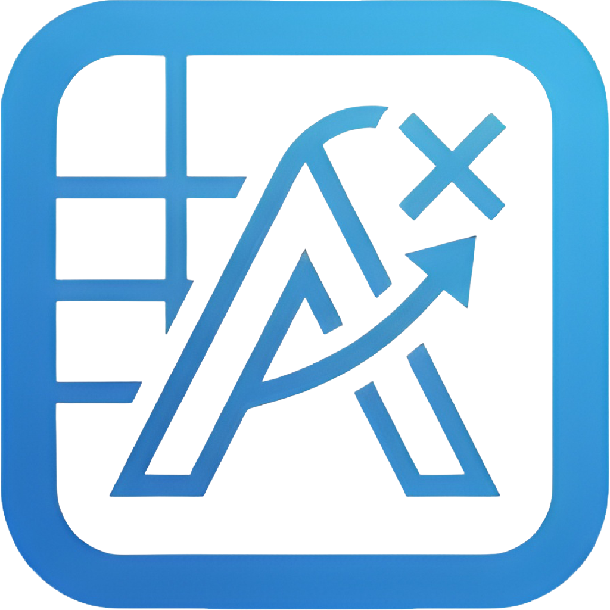

<p align="center">
  
</p>

<h1 align="center">Absentio</h1>
<p align="center"><strong>Devamsızlık Takip Uygulaması / Student Attendance Tracker</strong></p>
<p align="center">
  
  
  
  
</p>

---

## 🇹🇷 Türkçe

### Hakkında

Absentio, üniversite öğrencileri için geliştirilmiş bir devamsızlık takip uygulamasıdır. Ders bazlı devamsızlık limitlerinizi takip eder, sınıra yaklaştığınızda sizi uyarır ve dönem boyunca devamsızlık durumunuzu görselleştirir.

### Özellikler

- **Çoklu Dönem Desteği** — Birden fazla dönem oluşturun, aktif dönemi seçin
- **Ders Yönetimi** — Ders adı, renk kodu, haftalık program ve devamsızlık limiti tanımlayın
- **Devamsızlık Takibi** — Tek dokunuşla devamsızlık işaretleyin, sebep ekleyin
- **Gerçek Zamanlı Uyarılar** — Devamsızlık sınırına yaklaştığınızda, hakkınız bittiğinde ve dersten kaldığınızda farklı uyarılar
- **Haftalık Program** — Derslerinizin haftalık görünümü
- **Sınav Dönemleri** — Sınav haftalarını tanımlayın, o haftalarda ders yapılıp yapılmadığını belirtin
- **Dönem Geneli Devamsızlık** — Tüm dersler için tek bir devamsızlık oranı belirleyin veya ders bazlı ayarlayın
- **Tema Desteği** — Açık, koyu ve sistem teması
- **Çift Dil** — Türkçe ve İngilizce
- **Çevrimdışı Çalışır** — İnternet bağlantısı gerektirmez, tüm veriler cihazda saklanır

### Kurulum

[Releases](../../releases) sayfasından en son APK dosyasını indirip yükleyin.

### Derleme

```bash
git clone https://github.com/nitenshi/absentio.git
cd absentio
flutter pub get
dart run build_runner build --delete-conflicting-outputs
flutter build apk --release
```

---

## 🇬🇧 English

### About

Absentio is an attendance tracking app built for university students. It tracks your per-course absence limits, warns you when you're approaching the limit, and visualizes your attendance status throughout the semester.

### Features

- **Multi-Semester Support** — Create multiple semesters, select the active one
- **Course Management** — Define course name, color code, weekly schedule, and absence limit
- **Absence Tracking** — Mark absences with a single tap, add optional reasons
- **Real-Time Warnings** — Different warnings when approaching the limit, when no absences remain, and when you've failed the course
- **Weekly Schedule** — Visual weekly view of your classes
- **Exam Periods** — Define exam weeks and specify whether classes are held during them
- **Uniform Attendance** — Set a single attendance requirement for all courses or configure per-course
- **Theme Support** — Light, dark, and system theme
- **Bilingual** — Turkish and English
- **Works Offline** — No internet required, all data stored locally on device

### Installation

Download the latest APK from the [Releases](../../releases) page.

### Building from Source

```bash
git clone https://github.com/nitenshi/absentio.git
cd absentio
flutter pub get
dart run build_runner build --delete-conflicting-outputs
flutter build apk --release
```

---

## Tech Stack

| Component | Library |
|---|---|
| Framework | Flutter 3.x / Dart 3.11 |
| State Management | Riverpod |
| Database | Drift (SQLite) |
| Routing | GoRouter |
| Localization | Easy Localization |
| Local Storage | Shared Preferences |
| Design | Material Design 3 |

## Project Structure

```
lib/
├── main.dart
├── app/
│   ├── app.dart
│   ├── router.dart
│   ├── shell_scaffold.dart
│   └── theme/
├── core/
│   ├── constants/
│   ├── database/
│   │   ├── app_database.dart
│   │   ├── tables/
│   │   └── daos/
│   └── providers/
└── features/
    ├── onboarding/
    ├── dashboard/
    ├── course/
    ├── schedule/
    ├── semester/
    └── settings/
```

## License

MIT
